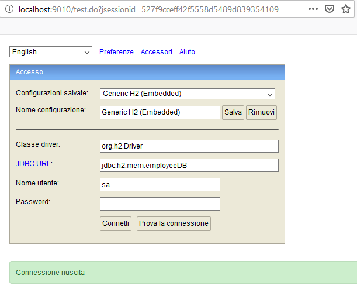

# Table of Contents

* [Scope](#scope)
* [Prerequisite](#prerequisite)
* [Installing](#installing)
* [Getting started](#getting-started)
  * [H2 Sql Script files](#h2-sql-script-files)
    * [Installing](#installing)
* [Navigation paths UI](#navigation-paths-ui)
* [H2 Configuration](#h2-configuration)
  * [H2 schema and data configuration](#h2-schema-and-data-configuration)
  * [H2 Configure the Spring XML context file](#h2-configure-the-spring-xml-context-file)
    * [H2 Enable web console](#h2-enable-web-console)
    * [Login to H2 web console](#login-to-h2-web-console)
* [Spring Configuration](#spring-configuration)
  * [Web Configuration](#web-configuration)
* [Rest API](#rest-api)    
  * [Create API](#create-api)
  * [Read API](#read-api)
  * [Update API](#update-api)
  * [Delete API](#delete-api)
* [Built with](#built-with)
    * [Default library dependency](#default-library-dependency)
      * [Maven plugins](#maven-plugins)
  * [Authors](#authors)  
  * [Licence](#licence)

# Scope

This is a Spring 4.x XML configuration CRUD example, based on employee management domain.  

# Prerequisite
* Java version 1.8
* Maven 

# Installing

This application was tested on following application server:  
*) Apache Tomcat 8.5.x

# Getting started

## H2 Sql Script files

### Schema

Path: spring4_mvc_integration_activemq_topic_producer/scr/main/resources/**schema.sql**  

### Data

Path: spring4_mvc_integration_activemq_topic_producer/scr/main/resources/**data.sql**  

# Navigation paths UI

### Home page
http://localhost:8080/spring4_mvc_integration_activemq_topic_producer/

### Employee UI  
http://localhost:8080/spring4_mvc_integration_activemq_topic_producer/employee-web/readEmployees  
http://localhost:8080/spring4_mvc_integration_activemq_topic_producer/employee-web/addEmployee

### H2 Web console
http://localhost:9010

# H2 Configuration

With H2 embedded configuration, you need to do the following steps:

1) Create the database structure
2) Configure the spring xml file context in order to use JPA based approach.
3) For debug purpose enable the H2 web console.

All these configuration can be found to:

*spring4_mvc_integration_activemq_topic_producer*/scr/main/webapp/WEB-INF/springConfig/**spring-database-context.xml** 

## H2 schema and data configuration
 
You need to add under the path ${project.basedir}/scr/main/resources the following file:
* **schema.sql**: this file represent your database model;
* **data.sql**  : this file represent the data to insert into your database model;  

## H2 Configure the Spring XML context file

### H2 Enable web console

In order to enable the H2 web console you need to define the following beans inside the spring context:

```
...
 <bean id="h2Server" class="org.h2.tools.Server" factory-method="createTcpServer" init-method="start" destroy-method="stop" depends-on="h2WebServer">
        <constructor-arg value="-tcp,-tcpAllowOthers,-tcpPort,9092"/>
    </bean> 
    
     <bean id="h2WebServer" class="org.h2.tools.Server" factory-method="createWebServer" init-method="start" destroy-method="stop"> 
         <constructor-arg value="-web,-webAllowOthers,-webPort,9010"/> 
    </bean> 
...

```

### Login to H2 web console

Go to http://localhost:9010 and enter the following data:  

**Class driver:** org.h2.Driver    
** JDBC URL:** jdbc:h2:mem:employeeDB  
**User name:** sa

The configuration for H2 connection are externalized into property file:  
${project.basedir}/scr/main/resources/**dbConnectionH2.properties**



# Oracle DB

## References


# Spring Configuration

## Web Configuration

# Rest API

## Create API
*TO_DO*  

## Read API 

### Read all employees
http://localhost:8080/spring4_mvc_integration_activemq_topic_producer/rest/api/employees

### Read employees by id
http://localhost:8080/spring4_mvc_integration_activemq_topic_producer/rest/api/employee/1

## Update API
*TO_DO*  

## Delete API
*TO_DO*

# Spring Integration configuration

## Message endpoint

### Adapter 
Convert Channel to other system

### Filter 
Manage messages from channel based on header/content

### Transformer
Convert message to another structure

### Enricher
Add content to message header/payload

### Service activator
Invoke service operation based on the arrival of message

### Gateway
Connect your channels without SI copuling

## Message Channels

### Pollable

### Subscribable

# ActiveMQ

## Start up ActiveMQ server

<your_path>\apache-activemq-5.16.0\bin>activemq.bat start  

## ActiveMQ

### Topic producer endpoint (SI)
 
**Endpoint:** http://localhost:8080/spring4_mvc_integration_activemq_topic_producer/activemq/topic/springintegration/obj/message  
**Type:** POST  
**Message:** EmployeeComplexPayload  
** EmployeeComplexPayload Body **

```
{"customMetadata":{"maxMessages":5},"employeeIntegrationPayload":{"id":1,"name":"EmployeeName","surname":"EmployeeSurname"}}
```

### Queues
**URL:** http://localhost:8161/admin/queues.jsp  
**uid:** admin  
**pass:** admin  

### Topic

#### Message
**HEADER:** Content-Type  
**Header value:** application/json  
**POST Message:**  

```
{"id":1,"name":"EmployeeSampleName_3","surname":"EmployeeSampleSurname"
}
```

** EmployeeComplexPayload conversion **

```
{"customMetadata":{"maxMessages":5},"employeeIntegrationPayload":{"id":1,"name":"EmployeeName","surname":"EmployeeSurname"}}
```
** Employee filter **

**Discarded** 
 
```
{"customMetadata":{"maxMessages":5},"employeeIntegrationPayload":{"id":1,"name":"EmployeeName","surname":"EmployeeSurname"}}
```
**Accepted**  

```
{"customMetadata":{"maxMessages":5},"employeeIntegrationPayload":{"id":1,"name":"bEmployeeName","surname":"EmployeeSurname"}}
```

# Built with
* [Java SDK Version](http://www.oracle.com/technetwork/java/javase/downloads/index.html) - 1.8
* [Maven](https://maven.apache.org/) - Dependency Management

## Default library dependency

### Maven plugins
* **maven-compiler-plugin.version:** 3.6.1

### Spring framework
* **spring.version:** 4.3.24

### Utils library

#### Database
* **h2.version:** 1.4.199

## Authors
*TO_DO*

## Licence
*TO_DO*

## Acknowledgments
*TO_DO*

